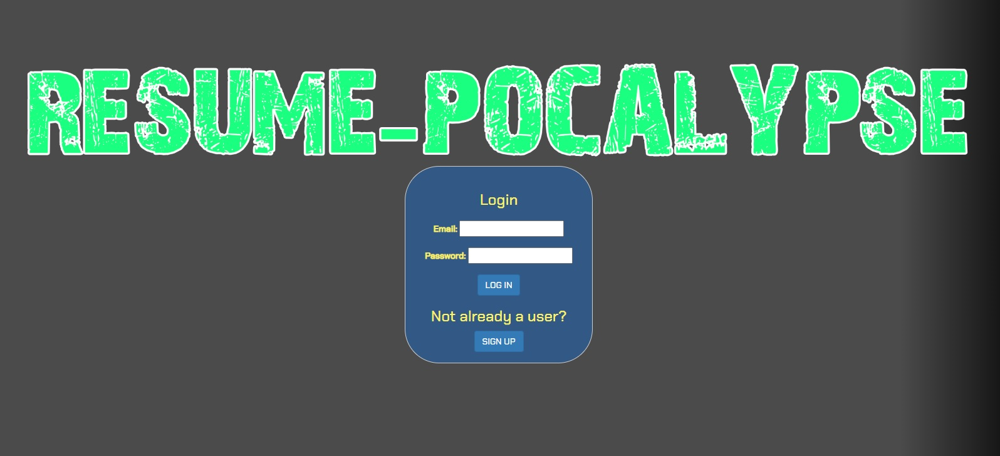

# Resume Pocalypse

## Description

We were tasked with creating a full stack application using Node.js, Object-Oriented Programming, Express.js, SQL, Object-Relational Mapping, and Handlebars. We chose to create a text based adventure game, that is in the theme of the Fallout video game franchise, that in the end, generates a professional resume.

## Installation

We used a combination of Node, Express, MySQL, Sequelize, Bootstrap, DotENV, Nodemon, Bcrypt, and PDFKit.

## Usage

When you first boot up the page, you would sign up and put in your information. It would then take you to the next page containing more user information fields that you would fill out for your resume. If you have already signed up, you would log in instead. When you select the Play Game button, the text based adventure game starts to display the questions and you answer each one. Once you have completed the game, it ends and a resume is generated.

## Credits

Collaborators are [Anthony](https://github.com/AnthGrow), [Gary](https://github.com/GHBond007), [Jessie](https://github.com/MrMessyFace), [José](https://github.com/Jose-seg), and [Reid](https://github.com/reidmadock), with [Jen](https://github.com/Jdoyle5254) as our advisor.

https://resume-pocalypse.herokuapp.com/